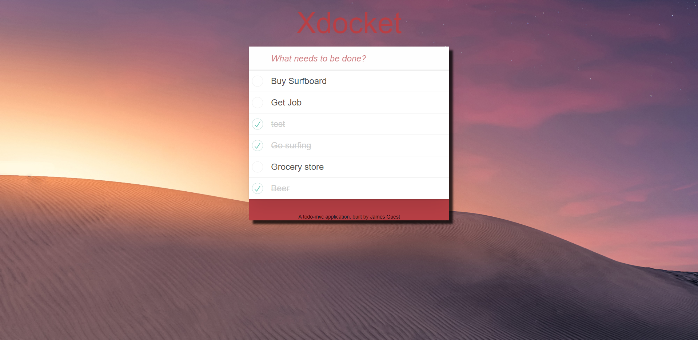
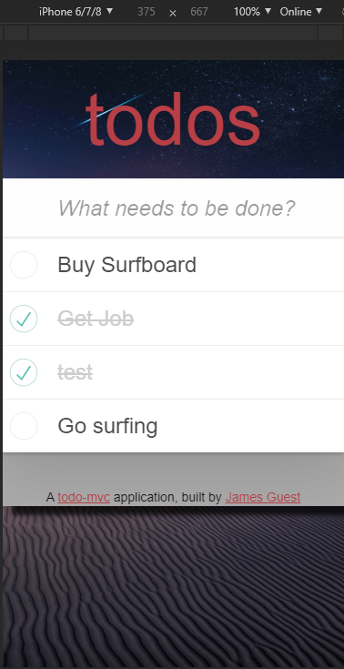

# Xdocket

This single-page to-do application features a fluid user interface that– by using JavaScript– allows users to rapidly add dynamic content.

## Deployment

- [https://xdocket.herokuapp.com/](https://xdocket.herokuapp.com/)

## Tech

- [Rails](https://rubyonrails.org/) - v: 5.2.3
- [postgreSQL](https://www.postgresql.org/) - Database
- [Heroku](https://devcenter.heroku.com/) - Deployment

## Built With

- [Ruby](https://www.ruby-lang.org/en/documentation/) v: 2.5.3
- [JavaScript](https://developer.mozilla.org/en-US/docs/Web/JavaScript) v: ES6
